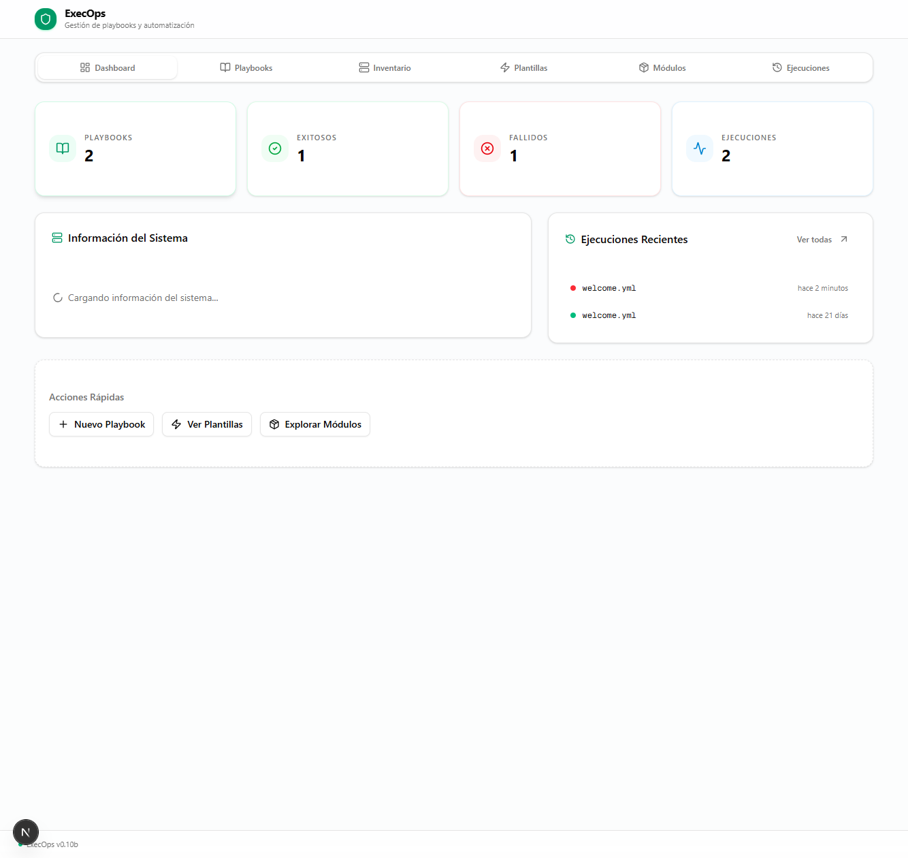
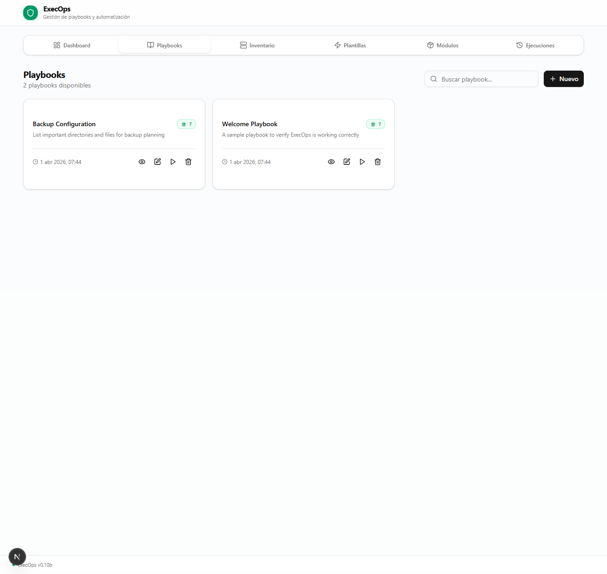
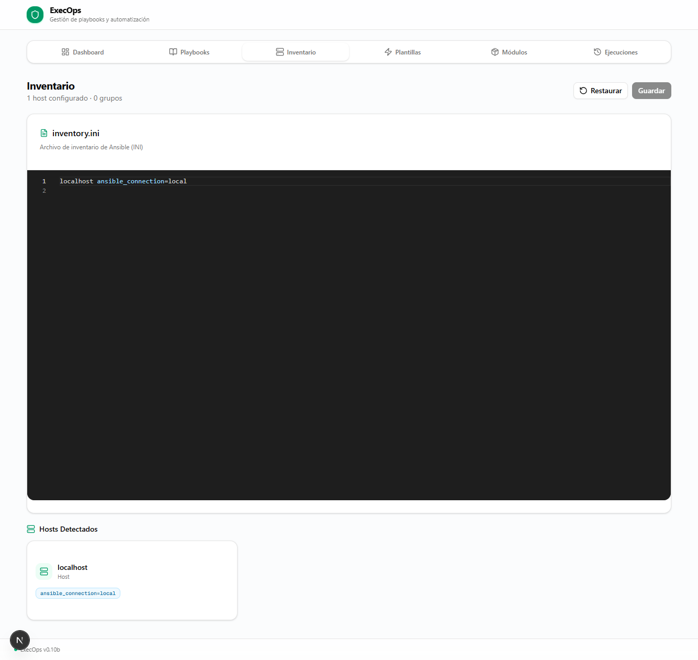
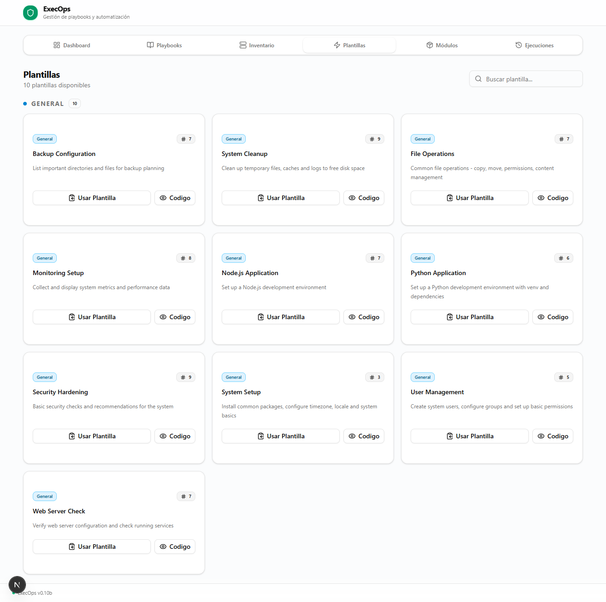
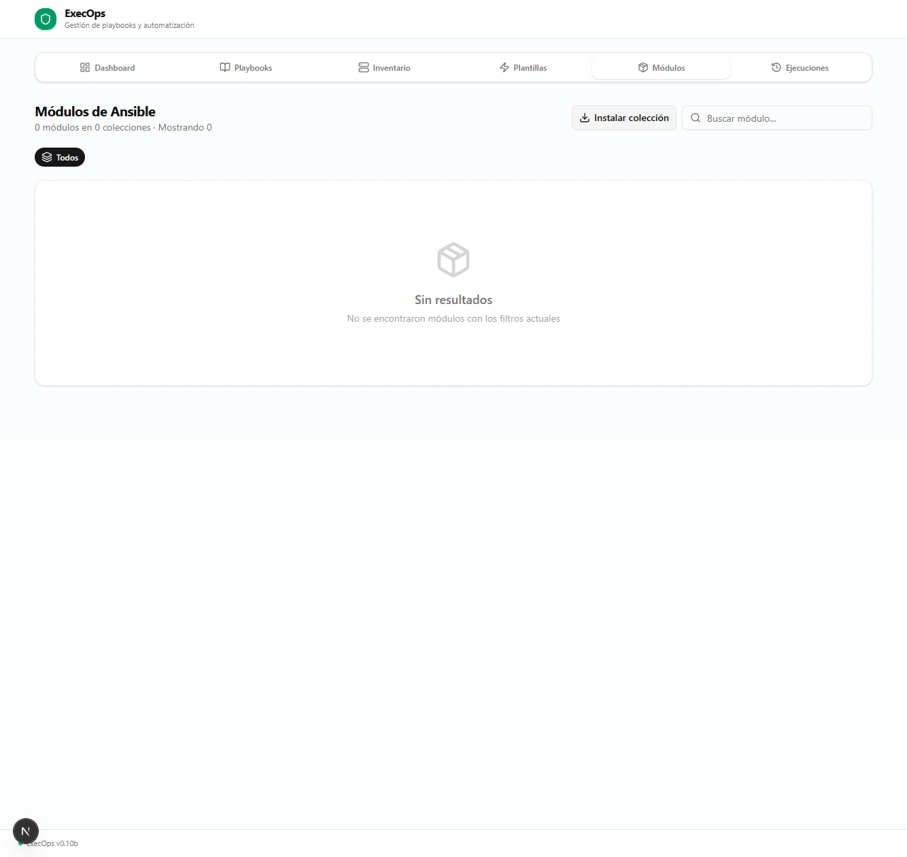
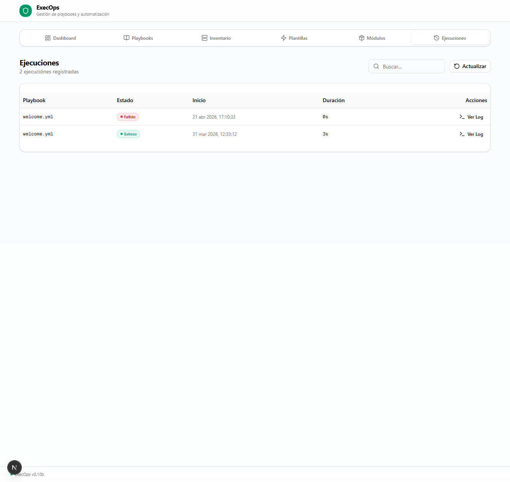
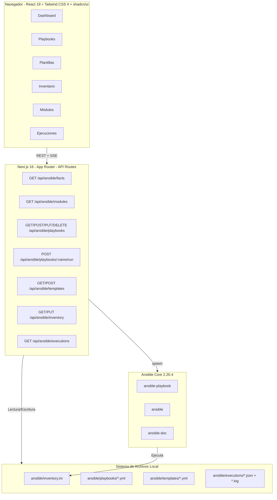
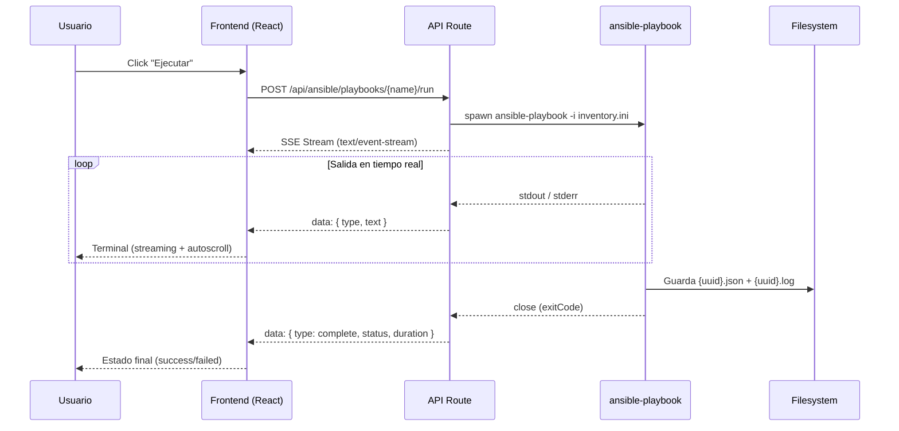
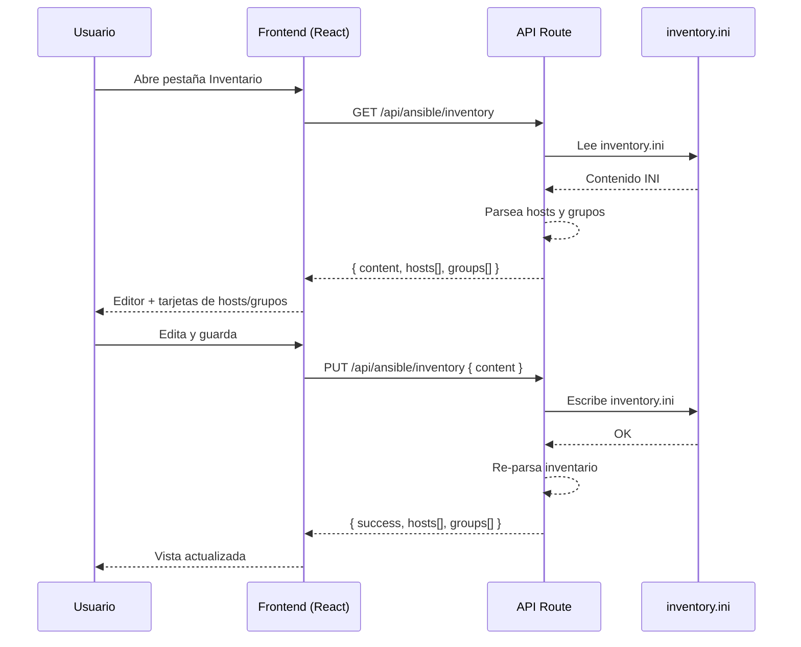

<p align="center">
  
</p>

<h1 align="center">ExecOps <sup>v0.01a</sup></h1>

<p align="center">
  <strong>Interfaz web para gestionar y ejecutar playbooks de Ansible directamente desde el navegador.</strong>
</p>

<p align="center">
  
  
  
  
  
  
  
  
</p>

<p align="center">
  <a href="#-características">Características</a> ·
  <a href="#-capturas">Capturas</a> ·
  <a href="#-instalación">Instalación</a> ·
  <a href="#-despliegue">Despliegue</a> ·
  <a href="#-api-reference">API</a> ·
  <a href="#-colecciones-ansible">Colecciones</a>
</p>

---

ExecOps es una aplicación full-stack construida con **Next.js 16** que permite crear, editar, visualizar y ejecutar playbooks de Ansible mediante una interfaz moderna y responsiva. Toda la ejecución se realiza de forma local (`connection: local`) con **streaming en tiempo real** de la salida de Ansible mediante Server-Sent Events (SSE).

## Tabla de Contenidos

- [Características](#-características)
  - [Dashboard](#dashboard)
  - [Gestión de Playbooks](#gestión-de-playbooks)
  - [Plantillas](#plantillas)
  - [Inventario](#inventario)
  - [Módulos](#módulos)
  - [Ejecuciones](#ejecuciones)
- [Capturas](#-capturas)
- [Arquitectura](#-arquitectura)
- [Stack Tecnológico](#-stack-tecnológico)
- [Estructura del Proyecto](#-estructura-del-proyecto)
- [Requisitos Previos](#-requisitos-previos)
- [Instalación](#-instalación)
- [Despliegue](#-despliegue)
- [API Reference](#-api-reference)
- [Colecciones Ansible](#-colecciones-ansible)
- [Plantillas Incluidas](#-plantillas-incluidas)
- [Limitaciones Conocidas](#-limitaciones-conocidas)
- [Changelog](#-changelog)
- [Licencia](#-licencia)

---

## ✨ Características

### Dashboard

- **Tarjetas de estadísticas**: playbooks totales, ejecuciones exitosas/fallidas
- **Información del sistema en tiempo real**: hostname, distribución, kernel, arquitectura, CPU, RAM con barra de uso visual, Python, uptime y tipo de virtualización
- **Ejecuciones recientes**: acceso rápido a los logs de las últimas ejecuciones
- **Acciones rápidas**: crear playbook, ver plantillas, explorar módulos

### Gestión de Playbooks

- **CRUD completo**: crear, ver, editar y eliminar playbooks YAML
- **Editor Monaco Editor**: resaltado de sintaxis YAML profesional (el mismo motor que VS Code)
- **Visor de código**: dialog fullscreen de solo lectura para consultar playbooks
- **Búsqueda y filtrado** en tiempo real por nombre
- **Ejecución en tiempo real** con streaming SSE (Server-Sent Events) de la salida de `ansible-playbook`
- **Terminal integrada** con salida stdout/stderr coloreada y autoscroll automático
- **Botón de abortar** ejecuciones en curso
- **Detección de cambios sin guardar**: aviso con `beforeunload` al cerrar pestaña o navegar con cambios pendientes
- Grid responsivo de tarjetas (1/2/3 columnas según viewport)

### Plantillas

- **10 plantillas predefinidas** organizadas por categoría
- **Instalación con un clic**: se copian como playbooks editables
- **Visor de código**: dialog fullscreen para consultar el código de cada plantilla antes de instalarla
- Categorías: System, Development, Security, Monitoring, Web, General

### Inventario

- **Editor integrado con Monaco Editor** para editar `inventory.ini` con resaltado de sintaxis INI
- **Análisis automático del inventario**: parseo en tiempo real que muestra hosts y grupos detectados
- **Visualización de hosts**: tarjetas con nombre del host y variables asociadas (conexión, usuario, puerto...)
- **Visualización de grupos**: lista de grupos con los hosts pertenecientes a cada uno
- **Guardado instantáneo** con confirmación de cambios y detección de modificaciones sin guardar
- Formato estándar INI de Ansible con soporte completo para variables de host y grupos

### Módulos

- **9,712 módulos** de Ansible indexados y buscables
- **93 colecciones** organizadas por popularidad con chips interactivos
- **25 colecciones** visibles como filtros rápidos con cuenta de módulos
- Búsqueda por nombre de módulo o colección
- Caché en memoria (5 min TTL) para respuestas rápidas
- Muestra hasta 200 módulos con paginación visual

### Ejecuciones

- **Tabla completa** con playbook, estado (success/failed/running), fecha y duración
- **Visor de logs fullscreen** con terminal oscura y scroll completo
- Búsqueda en el historial

---

## 📸 Capturas

La interfaz se compone de **6 pestañas** principales:

| Pestaña | Descripción |
|---------|-------------|
| **Dashboard** | Vista general con estadísticas, info del sistema y ejecuciones recientes |
| **Playbooks** | CRUD de playbooks con editor, ejecución en tiempo real y terminal |
| **Plantillas** | 10 plantillas predefinidas con instalación en un clic |
| **Inventario** | Editor de `inventory.ini` con parseo automático de hosts y grupos |
| **Módulos** | Explorador de 9,712 módulos en 92 colecciones de Ansible |
| **Ejecuciones** | Historial completo con visor de logs fullscreen |

### Dashboard

<p align="center">
  
</p>

### Playbooks

<p align="center">
  
</p>

### Inventario

<p align="center">
  
</p>

### Plantillas

<p align="center">
  
</p>

### Módulos

<p align="center">
  
</p>

### Ejecuciones

<p align="center">
  
</p>

---

## 🏗️ Arquitectura



### Flujo de ejecución de un playbook



### Flujo de gestión del inventario



---

## 🛠️ Stack Tecnológico

| Capa | Tecnología | Versión | Descripción |
|------|-----------|---------|-------------|
| **Framework** | Next.js (App Router) | 16.1+ | Framework React full-stack con SSR |
| **Runtime** | React | 19.0 | Librería de UI declarativa |
| **Lenguaje** | TypeScript | 5.x | Tipado estático |
| **Estilos** | Tailwind CSS | 4.x | Framework de utilidades CSS |
| **Componentes UI** | shadcn/ui (New York) | 43 | Componentes accesibles y personalizables |
| **Editor de código** | Monaco Editor | 4.x | Motor de VS Code para YAML e INI |
| **Iconos** | Lucide React | 0.525+ | Set de iconos SVG |
| **Animaciones** | Framer Motion | 12.x | Animaciones declarativas |
| **Notificaciones** | Sonner | 2.x | Toasts elegantes |
| **Fechas** | date-fns | 4.x | Formateo de fechas (locale ES) |
| **Motor Ansible** | Ansible Core | 2.20.4 | Automatización de infraestructura |
| **Almacenamiento** | Filesystem | - | Sin base de datos externa |

---

## 📁 Estructura del Proyecto

```
ExecOps/
├── ansible/                          # Datos de Ansible
│   ├── inventory.ini                 # Inventario: hosts, grupos, variables
│   ├── playbooks/                    # Playbooks creados por el usuario
│   │   └── welcome.yml               # Playbook de ejemplo
│   ├── templates/                    # 10 plantillas predefinidas
│   │   ├── backup-config.yml
│   │   ├── cleanup.yml
│   │   ├── file-operations.yml
│   │   ├── monitoring-setup.yml
│   │   ├── nodejs-app.yml
│   │   ├── python-app.yml
│   │   ├── security-hardening.yml
│   │   ├── system-setup.yml
│   │   ├── user-management.yml
│   │   └── web-server.yml
│   └── executions/                   # Historial de ejecuciones
│       ├── {uuid}.json               # Metadata: id, status, duration...
│       └── {uuid}.log                # Salida completa de ansible-playbook
│
├── public/
│   ├── screenshot.png                # Captura de pantalla para README
│   └── favicon.ico
│
├── src/
│   ├── app/
│   │   ├── globals.css               # Estilos globales + Tailwind
│   │   ├── layout.tsx                # Layout raíz (fuentes, metadata, OpenGraph)
│   │   ├── page.tsx                  # SPA principal (~2127 líneas)
│   │   └── api/
│   │       └── ansible/
│   │           ├── facts/route.ts           # GET  /api/ansible/facts
│   │           ├── modules/route.ts         # GET  /api/ansible/modules (caché 5 min)
│   │           ├── inventory/route.ts        # GET  /api/ansible/inventory
│   │           │                            # PUT  /api/ansible/inventory
│   │           ├── templates/route.ts       # GET  /api/ansible/templates
│   │           │                            # POST /api/ansible/templates
│   │           ├── playbooks/
│   │           │   ├── route.ts             # GET  /api/ansible/playbooks
│   │           │   │                        # POST /api/ansible/playbooks
│   │           │   └── [name]/
│   │           │       ├── route.ts         # GET    /api/ansible/playbooks/{name}
│   │           │       │                    # PUT    /api/ansible/playbooks/{name}
│   │           │       │                    # DELETE /api/ansible/playbooks/{name}
│   │           │       └── run/
│   │           │           └── route.ts     # POST /api/ansible/playbooks/{name}/run (SSE)
│   │           └── executions/
│   │               ├── route.ts             # GET /api/ansible/executions
│   │               └── [id]/
│   │                   └── route.ts         # GET /api/ansible/executions/{id}
│   │
│   ├── components/
│   │   └── ui/                      # 43 componentes shadcn/ui
│   │
│   ├── hooks/
│   │   ├── use-mobile.ts
│   │   └── use-toast.ts
│   │
│   └── lib/
│       ├── db.ts                     # Prisma client (disponible)
│       └── utils.ts                  # Utilidades (cn, etc.)
│
├── prisma/
│   └── schema.prisma                 # Schema Prisma (SQLite)
│
├── package.json                      # Dependencias y scripts
├── tsconfig.json                     # Configuración TypeScript
├── next.config.ts                    # Configuración Next.js
└── README.md                         # Este archivo
```

**Total de código fuente:** ~2,500+ líneas (API routes + página principal)

---

## 📋 Requisitos Previos

| Requisito | Versión Mínima | Notas |
|-----------|---------------|-------|
| **Bun** | 1.3+ | Runtime JavaScript/TypeScript |
| **Ansible** | 2.20+ | Instalado via pip en `~/.local/bin/` |
| **Python** | 3.12+ | Requerido por Ansible |
| **SO** | Linux/Debian | Ansible `connection: local` |

### Verificación de requisitos

```bash
# Comprobar Bun
bun --version

# Comprobar Ansible
~/.local/bin/ansible --version

# Comprobar Python
python3 --version

# Verificar binarios de Ansible
ls ~/.local/bin/ansible*
# ansible  ansible-config  ansible-console  ansible-doc  ansible-galaxy  ansible-playbook  ansible-vault
```

---

## 🚀 Instalación

### 1. Clonar el repositorio

```bash
git clone https://github.com/ExecOps/ExecOps.git
cd ExecOps
```

### 2. Instalar dependencias

```bash
bun install
```

### 3. Instalar Ansible

```bash
pip install --break-system-packages ansible
```

> ⚠️ En algunos sistemas puede requerir `--user` en lugar de `--break-system-packages`.

Verifica la instalación:

```bash
~/.local/bin/ansible --version
# ansible [core 2.20.4]
```

### 4. Instalar colecciones de Ansible

ExecOps soporta **93 colecciones**. Para instalarlas todas:

```bash
~/.local/bin/ansible-galaxy collection install amazon.aws ansible.netcommon ansible.posix ansible.utils ansible.windows \
  arista.eos azure.azcollection check_point.mgmt chocolatey.chocolatey cisco.aci cisco.dnac cisco.intersight \
  cisco.ios cisco.iosxr cisco.meraki cisco.mso cisco.nxos cisco.ucs cloudscale_ch.cloud community.aws \
  community.ciscosmb community.clickhouse community.crypto community.dns community.docker community.general \
  community.grafana community.hashi_vault community.hrobot community.library_inventory_filtering_v1 community.libvirt \
  community.mongodb community.mysql community.okd community.postgresql community.proxmox community.proxysql \
  community.rabbitmq community.routeros community.sap_libs community.sops community.vmware community.windows \
  community.zabbix containers.podman cyberark.conjur cyberark.pas dellemc.enterprise_sonic dellemc.openmanage \
  dellemc.powerflex dellemc.unity f5networks.f5_modules fortinet.fortimanager fortinet.fortios google.cloud \
  grafana.grafana graphiant.naas hetzner.hcloud hitachivantara.vspone_block hitachivantara.vspone_object \
  ibm.storage_virtualize ieisystem.inmanage infinidat.infinibox infoblox.nios_modules inspur.ispim \
  kaytus.ksmanage kubernetes.core kubevirt.core lowlydba.sqlserver microsoft.ad microsoft.iis netapp.ontap \
  netapp.storagegrid netapp_eseries.santricity netbox.netbox ngine_io.cloudstack openstack.cloud ovirt.ovirt \
  pcg.alpaca_operator purestorage.flasharray purestorage.flashblade ravendb.ravendb splunk.es \
  telekom_mms.icinga_director theforeman.foreman vmware.vmware vmware.vmware_rest vultr.cloud vyos.vyos wti.remote
```

> 💡 Si solo necesitas las colecciones básicas, instala al menos `ansible.builtin` (viene con Ansible Core).

### 5. Crear inventario local

El inventario se crea automáticamente si no existe, pero puedes crearlo manualmente:

```bash
cat > ansible/inventory.ini << 'EOF'
localhost ansible_connection=local
EOF
```

### 6. Iniciar en modo desarrollo

```bash
bun run dev
```

La aplicación estará disponible en `http://localhost:3000`.

---

## 🌐 Despliegue

### Desarrollo

```bash
bun run dev
# → http://localhost:3000
# → Logs en dev.log
```

### Producción con Bun

```bash
# Compilar
bun run build

# Iniciar servidor standalone
bun run start
# → http://localhost:3000
# → Logs en server.log
```

### Variables de entorno opcionales

No se requieren variables de entorno para el funcionamiento básico. Todos los paths son absolutos y configurados en las rutas API.

Si necesitas personalizar, puedes crear un `.env.local`:

```env
# Puerto del servidor
PORT=3000

# Paths a los binarios de Ansible (por defecto ~/.local/bin/)
ANSIBLE_BIN=/usr/local/bin/ansible
ANSIBLE_PLAYBOOK_BIN=/usr/local/bin/ansible-playbook
ANSIBLE_DOC_BIN=/usr/local/bin/ansible-doc
```

### Configuración de paths

Los binarios de Ansible están configurados por defecto en `~/.local/bin/`. Si tu instalación usa un path diferente, edita estos archivos:

| Archivo | Variable | Default |
|---------|----------|---------|
| `src/app/api/ansible/facts/route.ts` | `ANSIBLE`, `ANSIBLE_PLAYBOOK_BIN` | `/home/z/.local/bin/ansible` |
| `src/app/api/ansible/playbooks/[name]/run/route.ts` | `ANSIBLE_PLAYBOOK` | `/home/z/.local/bin/ansible-playbook` |
| `src/app/api/ansible/modules/route.ts` | `ANSIBLE_DOC` | `/home/z/.local/bin/ansible-doc` |

### Detener el servidor

- **Desarrollo**: `Ctrl+C` o `kill` del proceso `bun run dev`
- **Producción**: `SIGTERM` al proceso `bun run start`

---

## 📡 API Reference

Todas las respuestas son JSON. Los errores retornan `{ error: string }` con el código HTTP apropiado.

### System Facts

```
GET /api/ansible/facts
```

Ejecuta `ansible localhost -m setup` y devuelve los facts del sistema.

**Response 200:**
```json
{
  "hostname": "server-01",
  "distribution": "Debian",
  "distribution_version": "13.3",
  "distribution_release": "trixie",
  "architecture": "x86_64",
  "kernel": "5.10.134-013.5.kangaroo.al8.x86_64",
  "os_family": "Debian",
  "system": "Linux",
  "processor_vcpus": 4,
  "processor_count": 1,
  "memtotal_mb": 8210,
  "memfree_mb": 3737,
  "memreal": { "free": 3737, "total": 8210, "used": 4473 },
  "swaptotal_mb": 0,
  "swapfree_mb": 0,
  "python_version": "3.13.5",
  "uptime_seconds": 3883,
  "virtualization_type": "docker",
  "ansible_version": "2.20.4"
}
```

### Playbooks

```
GET    /api/ansible/playbooks          # Listar todos
POST   /api/ansible/playbooks          # Crear nuevo
GET    /api/ansible/playbooks/:name    # Obtener contenido
PUT    /api/ansible/playbooks/:name    # Actualizar contenido
DELETE /api/ansible/playbooks/:name    # Eliminar
POST   /api/ansible/playbooks/:name/run  # Ejecutar (SSE Stream)
```

**GET /api/ansible/playbooks → 200:**
```json
[
  {
    "name": "welcome.yml",
    "displayName": "Welcome Playbook",
    "description": "A sample playbook...",
    "taskCount": 7,
    "size": 1673,
    "modified": 1743401400000,
    "created": 1743401400000
  }
]
```

**POST /api/ansible/playbooks → 201:**
```json
// Request body:
{ "name": "mi-playbook", "description": "Descripción", "content": "---\n- name: ..." }

// Response:
{ "name": "mi-playbook.yml", "displayName": "mi-playbook", "description": "Descripción", "created": 1743401400000 }
```

**POST /api/ansible/playbooks/:name/run → 200 (SSE Stream):**
```
Content-Type: text/event-stream

data: {"type":"stdout","text":"PLAY [Welcome Playbook] ***\n"}
data: {"type":"stdout","text":"TASK [Gathering Facts] ***\n"}
data: {"type":"stderr","text":"[WARNING]: ...\n"}
data: {"type":"stdout","text":"ok: [localhost]\n"}
data: {"type":"complete","status":"success","exitCode":0,"duration":3842}
```

### Inventory

```
GET  /api/ansible/inventory   # Leer y parsear inventario
PUT  /api/ansible/inventory   # Guardar inventario
```

**GET /api/ansible/inventory → 200:**
```json
{
  "content": "localhost ansible_connection=local\n\n[webservers]\nweb1 ansible_host=192.168.1.10\n",
  "hosts": [
    { "name": "localhost", "vars": { "ansible_connection": "local" } },
    { "name": "web1", "vars": { "ansible_host": "192.168.1.10" } }
  ],
  "groups": [
    { "name": "webservers", "hosts": ["web1"], "vars": {} }
  ]
}
```

**PUT /api/ansible/inventory → 200:**
```json
// Request body:
{ "content": "localhost ansible_connection=local\n[webservers]\nweb1 ansible_host=192.168.1.10\n" }

// Response:
{ "success": true, "content": "...", "hosts": [...], "groups": [...] }
```

### Templates

```
GET  /api/ansible/templates                    # Listar plantillas
POST /api/ansible/templates                    # Copiar plantilla como playbook
GET  /api/ansible/templates?name={name}        # Obtener contenido de una plantilla
```

**GET /api/ansible/templates → 200:**
```json
[
  {
    "name": "system-setup.yml",
    "displayName": "System Setup",
    "description": "Install common packages...",
    "category": "System",
    "taskCount": 3
  }
]
```

**POST /api/ansible/templates → 200:**
```json
// Request body:
{ "templateName": "system-setup.yml", "newPlaybookName": "mi-sistema" }

// Response:
{ "success": true, "name": "mi-sistema.yml", "displayName": "mi-sistema" }
```

### Modules

```
GET /api/ansible/modules
```

Lista todos los módulos de Ansible instalados. Usa caché en memoria (5 min TTL).

**GET /api/ansible/modules → 200:**
```json
{
  "total": 9712,
  "modules": [
    {
      "name": "ansible.builtin.copy",
      "collection": "ansible.builtin",
      "shortName": "copy"
    }
  ],
  "collections": [
    { "name": "fortinet.fortimanager", "count": 1294 },
    { "name": "cisco.dnac", "count": 1105 },
    { "name": "community.general", "count": 586 }
  ]
}
```

### Executions

```
GET /api/ansible/executions        # Listar historial
GET /api/ansible/executions/:id    # Obtener ejecución + log
```

**GET /api/ansible/executions → 200:**
```json
[
  {
    "id": "550e8400-e29b-41d4-a716-446655440000",
    "playbook": "welcome.yml",
    "status": "success",
    "startTime": 1743401400000,
    "endTime": 1743401403842,
    "duration": 3842,
    "exitCode": 0
  }
]
```

**GET /api/ansible/executions/:id → 200:**
```json
{
  "id": "550e8400-29b-41d4-a716-446655440000",
  "playbook": "welcome.yml",
  "status": "success",
  "startTime": 1743401400000,
  "endTime": 1743401403842,
  "duration": 3842,
  "exitCode": 0,
  "log": "PLAY [Welcome Playbook] ***\nTASK [Gathering Facts] ***\nok: [localhost]\n..."
}
```

---

## 📦 Colecciones Ansible

ExecOps soporta **93 colecciones** de Ansible con un total de **9,712 módulos** indexados:

| # | Colección | Módulos | Descripción |
|---|-----------|---------|-------------|
| 1 | `fortinet.fortimanager` | 1,294 | Gestión de FortiManager |
| 2 | `cisco.dnac` | 1,105 | Cisco DNA Center |
| 3 | `fortinet.fortios` | 709 | Gestión de FortiOS / FortiGate |
| 4 | `cisco.meraki` | 684 | Cisco Meraki Dashboard API |
| 5 | `community.general` | 586 | Utilidades generales de la comunidad |
| 6 | `azure.azcollection` | 412 | Microsoft Azure |
| 7 | `check_point.mgmt` | 408 | Check Point Security Management |
| 8 | `cisco.aci` | 287 | Cisco ACI (Application Centric Infrastructure) |
| 9 | `google.cloud` | 194 | Google Cloud Platform |
| 10 | `hitachivantara.vspone_block` | 173 | Hitachi VSP One Block |
| 11 | `community.vmware` | 171 | VMware vSphere |
| 12 | `netapp.ontap` | 164 | NetApp ONTAP |
| 13 | `community.aws` | 141 | AWS (comunidad) |
| 14 | `amazon.aws` | 140 | AWS (oficial) |
| 15 | `cisco.mso` | 135 | Cisco Multi-Site Orchestrator |
| 16 | `vmware.vmware_rest` | 134 | VMware REST API |
| 17 | `ieisystem.inmanage` | 133 | IEI System InManage |
| 18 | `kaytus.ksmanage` | 130 | Kaytus Server Management |
| 19 | `inspur.ispim` | 128 | Inspur Server Management |
| 20 | `cisco.intersight` | 120 | Cisco Intersight |
| 21 | `dellemc.openmanage` | 105 | Dell EMC OpenManage |
| 22 | `openstack.cloud` | 98 | OpenStack Cloud |
| 23 | `theforeman.foreman` | 92 | Foreman / Katello |
| 24 | `netbox.netbox` | 90 | NetBox DCIM/IPAM |
| 25 | `dellemc.enterprise_sonic` | 87 | Dell Enterprise SONiC |
| 26 | `cisco.nxos` | 78 | Cisco NX-OS |
| 27 | `ansible.builtin` | 71 | Módulos integrados de Ansible |
| 28 | `purestorage.flasharray` | 67 | Pure Storage FlashArray |
| 29 | `ansible.windows` | 65 | Módulos nativos de Windows |
| 30 | `ovirt.ovirt` | 58 | oVirt / RHV Virtualización |
| 31 | `community.grafana` | 55 | Grafana |
| 32 | `f5networks.f5_modules` | 179 | F5 Networks BIG-IP |
| 33 | `community.routeros` | 55 | MikroTik RouterOS |
| 34 | `community.zabbix` | 54 | Zabbix Monitoring |
| 35 | `community.crypto` | 52 | Criptografía y certificados |
| 36 | `community.docker` | 49 | Docker |
| 37 | `community.postgresql` | 48 | PostgreSQL |
| 38 | `arista.eos` | 47 | Arista EOS |
| 39 | `community.mysql` | 46 | MySQL |
| 40 | `community.hashi_vault` | 44 | HashiCorp Vault |
| 41 | `containers.podman` | 42 | Podman Containers |
| 42 | `cisco.ios` | 41 | Cisco IOS |
| 43 | `cisco.iosxr` | 40 | Cisco IOS XR |
| 44 | `community.okd` | 39 | OpenShift / OKD |
| 45 | `cisco.ucs` | 38 | Cisco UCS Manager |
| 46 | `kubernetes.core` | 38 | Kubernetes |
| 47 | `hetzner.hcloud` | 37 | Hetzner Cloud |
| 48 | `lowlydba.sqlserver` | 37 | Microsoft SQL Server |
| 49 | `community.libvirt` | 36 | libvirt KVM/QEMU |
| 50 | `ansible.posix` | 35 | Módulos POSIX |
| 51 | `microsoft.ad` | 35 | Active Directory |
| 52 | `chocolatey.chocolatey` | 34 | Chocolatey Package Manager |
| 53 | `community.mongodb` | 34 | MongoDB |
| 54 | `purestorage.flashblade` | 34 | Pure Storage FlashBlade |
| 55 | `kubevirt.core` | 33 | KubeVirt |
| 56 | `ansible.netcommon` | 32 | Redes comunes de Ansible |
| 57 | `community.proxmox` | 31 | Proxmox VE |
| 58 | `cyberark.pas` | 30 | CyberArk PAS |
| 59 | `dellemc.powerflex` | 30 | Dell PowerFlex |
| 60 | `splunk.es` | 30 | Splunk Enterprise Security |
| 61 | `community.rabbitmq` | 29 | RabbitMQ |
| 62 | `vyos.vyos` | 28 | VyOS |
| 63 | `community.proxysql` | 27 | ProxySQL |
| 64 | `community.sap_libs` | 27 | SAP Libraries |
| 65 | `infinidat.infinibox` | 26 | Infinidat InfiniBox |
| 66 | `dellemc.unity` | 25 | Dell EMC Unity |
| 67 | `telekom_mms.icinga_director` | 25 | Icinga Director |
| 68 | `community.sops` | 24 | Mozilla SOPS |
| 69 | `community.hrobot` | 23 | Hetzner Robot |
| 70 | `netapp.storagegrid` | 23 | NetApp StorageGRID |
| 71 | `community.dns` | 22 | DNS |
| 72 | `microsoft.iis` | 21 | IIS Web Server |
| 73 | `infoblox.nios_modules` | 20 | Infoblox NIOS |
| 74 | `netapp_eseries.santricity` | 20 | NetApp E-Series SANtricity |
| 75 | `hitachivantara.vspone_object` | 20 | Hitachi VSP One Object |
| 76 | `ibm.storage_virtualize` | 19 | IBM Storage Virtualize |
| 77 | `cyberark.conjur` | 18 | CyberArk Conjur |
| 78 | `community.ciscosmb` | 18 | Cisco SMB |
| 79 | `ravendb.ravendb` | 18 | RavenDB |
| 80 | `community.clickhouse` | 17 | ClickHouse |
| 81 | `community.windows` | 17 | Windows (comunidad) |
| 82 | `cloudscale_ch.cloud` | 16 | Cloudscale.ch |
| 83 | `community.sap_libs` | — | SAP Libraries |
| 84 | `community.library_inventory_filtering_v1` | — | Inventory Filtering v1 |
| 85 | `vultr.cloud` | 16 | Vultr Cloud |
| 86 | `ngine_io.cloudstack` | 16 | Apache CloudStack |
| 87 | `ansible.utils` | 15 | Utilidades de Ansible |
| 88 | `wti.remote` | 15 | WTI Remote Console |
| 89 | `awx.awx` | 14 | AWX / Ansible Tower |
| 90 | `graphiant.naas` | 14 | Graphiant NaaS |
| 91 | `pcg.alpaca_operator` | 13 | PCG Alpaca Operator |
| 92 | `grafana.grafana` | — | Grafana (oficial) |
| 93 | `purestorage.flasharray` | — | Pure Storage FlashArray |

### Lista completa de colecciones instaladas

```
amazon.aws
ansible.builtin
ansible.netcommon
ansible.posix
ansible.utils
ansible.windows
arista.eos
azure.azcollection
check_point.mgmt
chocolatey.chocolatey
cisco.aci
cisco.dnac
cisco.intersight
cisco.ios
cisco.iosxr
cisco.meraki
cisco.mso
cisco.nxos
cisco.ucs
cloudscale_ch.cloud
community.aws
community.ciscosmb
community.clickhouse
community.crypto
community.dns
community.docker
community.general
community.grafana
community.hashi_vault
community.hrobot
community.library_inventory_filtering_v1
community.libvirt
community.mongodb
community.mysql
community.okd
community.postgresql
community.proxmox
community.proxysql
community.rabbitmq
community.routeros
community.sap_libs
community.sops
community.vmware
community.windows
community.zabbix
containers.podman
cyberark.conjur
cyberark.pas
dellemc.enterprise_sonic
dellemc.openmanage
dellemc.powerflex
dellemc.unity
f5networks.f5_modules
fortinet.fortimanager
fortinet.fortios
google.cloud
grafana.grafana
graphiant.naas
hetzner.hcloud
hitachivantara.vspone_block
hitachivantara.vspone_object
ibm.storage_virtualize
ieisystem.inmanage
infinidat.infinibox
infoblox.nios_modules
inspur.ispim
kaytus.ksmanage
kubernetes.core
kubevirt.core
lowlydba.sqlserver
microsoft.ad
microsoft.iis
netapp.ontap
netapp.storagegrid
netapp_eseries.santricity
netbox.netbox
ngine_io.cloudstack
openstack.cloud
ovirt.ovirt
pcg.alpaca_operator
purestorage.flasharray
purestorage.flashblade
ravendb.ravendb
splunk.es
telekom_mms.icinga_director
theforeman.foreman
vmware.vmware
vmware.vmware_rest
vultr.cloud
vyos.vyos
wti.remote
```

---

## 📋 Plantillas Incluidas

| Archivo | Nombre | Categoría | Descripción |
|---------|--------|-----------|-------------|
| `system-setup.yml` | System Setup | System | Instala paquetes comunes, verifica timezone y locale |
| `web-server.yml` | Web Server Check | Web | Verifica estado de Next.js, Caddy y servicios web |
| `security-hardening.yml` | Security Hardening | Security | Comprueba puertos abiertos, procesos, disco y RAM |
| `monitoring-setup.yml` | Monitoring Setup | Monitoring | Configuración de monitorización del sistema |
| `cleanup.yml` | System Cleanup | System | Limpieza de archivos temporales y caches |
| `backup-config.yml` | Backup Config | System | Gestiona copias de seguridad de configuración |
| `file-operations.yml` | File Operations | General | Operaciones comunes con archivos y directorios |
| `user-management.yml` | User Management | General | Gestión básica de usuarios y permisos |
| `nodejs-app.yml` | Node.js Application | Development | Configura entorno de desarrollo Node.js/Bun |
| `python-app.yml` | Python Application | Development | Configura entorno de desarrollo Python |

### Formato de metadatos de plantillas

Las plantillas usan comentarios YAML como metadatos:

```yaml
# name: Nombre para mostrar
# description: Descripción de la plantilla
# category: Categoría de agrupación
---
- name: Nombre del Playbook
  hosts: localhost
  connection: local
  become: false
  tasks:
    - name: Descripción de la tarea
      ansible.builtin.debug:
        msg: "Hola mundo"
```

---

## ⚠️ Limitaciones Conocidas

1. **Solo `connection: local`** — No es posible ejecutar playbooks en hosts remotos via SSH. Toda la ejecución es local al servidor.

2. **Sin base de datos** — Los datos se almacenan en el filesystem (`ansible/`). No hay persistencia SQL.

3. **Sin autenticación** — No hay sistema de login. Cualquier usuario con acceso a la URL puede gestionar playbooks.

4. **Sin dark mode** — La interfaz es solo modo claro.

5. **Ejecución secuencial** — Solo se puede ejecutar un playbook a la vez. No hay cola de ejecuciones.

6. **Sin roles Ansible** — No hay soporte para gestionar roles de Ansible (solo playbooks planos).

7. **Módulos (solo listado)** — La pestaña de módulos solo muestra nombres y colecciones. No incluye documentación ni ejemplos.

8. **Plantillas de solo lectura** — Las plantillas originales no se pueden editar desde la UI (se deben copiar como playbooks primero).

9. **Módulos cacheados** — La lista de módulos se cachea durante 5 minutos. Si se instalan colecciones nuevas, pueden pasar hasta 5 minutos en aparecer.

---

## 📝 Changelog

### v0.01a (2026-04-01)

- **Primera versión alpha**
- Dashboard con estadísticas e información del sistema en tiempo real
- CRUD completo de playbooks con editor Monaco (YAML)
- Ejecución de playbooks con streaming SSE en tiempo real y autoscroll
- 10 plantillas predefinidas por categoría con visor de código
- Gestión de inventario con editor Monaco (INI), parseo automático de hosts y grupos
- Explorador de 9,712 módulos en 93 colecciones de Ansible
- Historial de ejecuciones con visor de logs en terminal oscura
- Detección de cambios sin guardar (beforeunload)
- Interfaz responsiva con animaciones (Framer Motion)
- 10 endpoints API REST
- Sin autenticación
- Sin base de datos (filesystem only)

---

## 📄 Licencia

MIT License. See [LICENSE](LICENSE) for details.

---

<p align="center">
  <strong>ExecOps</strong> · Built with Next.js 16, React 19, Tailwind CSS 4, shadcn/ui y Ansible Core 2.20.4
</p>
<p align="center">
  <a href="https://github.com/ExecOps/ExecOps">GitHub</a> ·
  <a href="https://github.com/ExecOps/ExecOps/issues">Issues</a>
</p>
