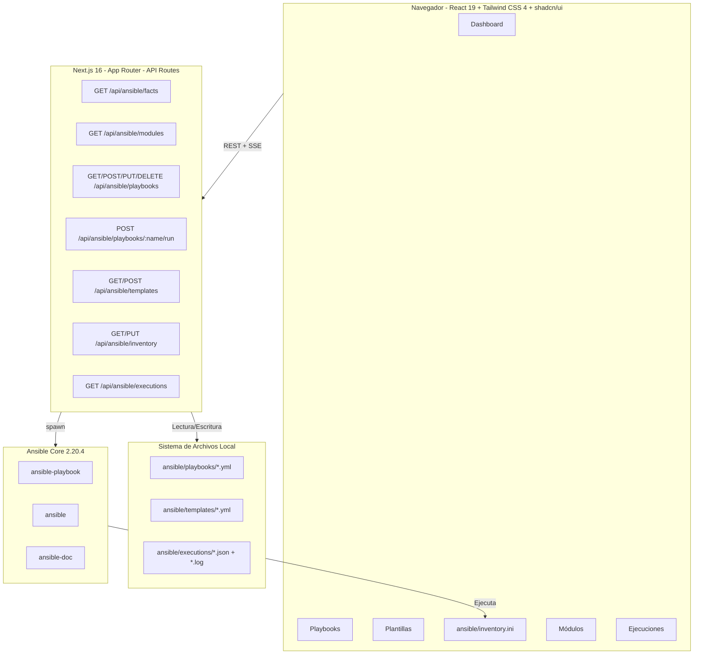
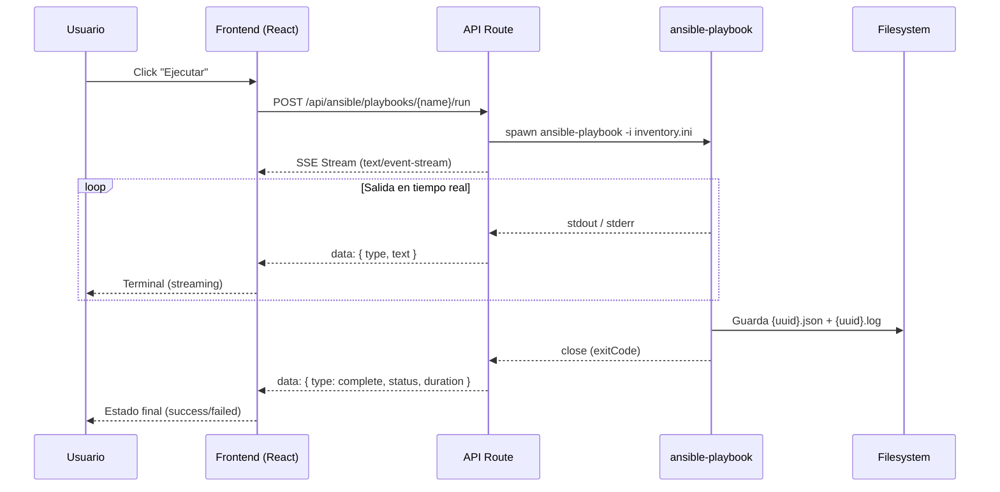

# ExecOps v0.10b

**Interfaz web para gestionar y ejecutar playbooks de Ansible directamente desde el navegador.**

ExecOps es una aplicación full-stack construida con Next.js 16 que permite crear, editar, visualizar y ejecutar playbooks de Ansible mediante una interfaz moderna y responsiva. Toda la ejecución se realiza de forma local (`connection: local`) con streaming en tiempo real de la salida de Ansible.

---

## Tabla de Contenidos

- [Características](#características)
- [Capturas](#capturas)
- [Arquitectura](#arquitectura)
- [Stack Tecnológico](#stack-tecnológico)
- [Estructura del Proyecto](#estructura-del-proyecto)
- [Requisitos Previos](#requisitos-previos)
- [Instalación](#instalación)
- [Despliegue](#despliegue)
- [API Reference](#api-reference)
- [Plantillas Incluidas](#plantillas-incluidas)
- [Limitaciones Conocidas](#limitaciones-conocidas)
- [Changelog](#changelog)
- [Licencia](#licencia)

---

## Caracteristicas

### Dashboard
- Tarjetas de estadisticas: playbooks totales, ejecuciones exitosas/fallidas
- Informacion del sistema en tiempo real (hostname, SO, kernel, arquitectura, CPU, RAM con barra de uso, Python, uptime)
- Ejecuciones recientes con acceso rapido a logs
- Acciones rapidas: crear playbook, ver plantillas, explorar modulos

### Gestion de Playbooks
- **CRUD completo**: crear, ver, editar y eliminar playbooks YAML
- **Busqueda y filtrado** en tiempo real
- **Ejecucion en tiempo real** con streaming SSE (Server-Sent Events) de la salida de `ansible-playbook`
- Terminal integrada con salida stdout/stderr coloreada
- Boton de abortar ejecuciones en curso
- Grid responsivo de tarjetas (1/2/3 columnas segun viewport)

### Plantillas
- 10 plantillas predefinidas organizadas por categoria
- Instalacion con un clic: se copian como playbooks editables
- Categorias: System, Development, Security, Monitoring, Web, General

### Inventario
- **Editor integrado con Monaco Editor** para editar `inventory.ini` con resaltado de sintaxis INI
- **Analisis automatico del inventario**: parseo en tiempo real que muestra hosts y grupos detectados
- **Visualizacion de hosts**: tarjetas con nombre del host y variables asociadas (conexion, usuario, puerto...)
- **Visualizacion de grupos**: lista de grupos con los hosts pertenecientes a cada uno
- **Guardado instantaneo** con confirmacion de cambios y deteccion de modificaciones sin guardar
- Formato estandar INI de Ansible con soporte completo para variables de host y grupos

### Explorador de Modulos
- **9,713 modulos** de Ansible indexados y buscables
- Organizados por coleccion (fortinet, cisco, community.general, azure, amazon.aws...)
- Filtros por coleccion con chips interactivos
- Busqueda por nombre de modulo o coleccion

### Historial de Ejecuciones
- Tabla completa con playbook, estado (success/failed/running), fecha, duracion
- Visor de logs con terminal oscuro
- Busqueda en el historial

---

## Capturas

<p align="center">
  
</p>

La interfaz se compone de 6 pestañas principales: **Dashboard**, **Playbooks**, **Plantillas**, **Inventario**, **Módulos** y **Ejecuciones**.

---

## Arquitectura



**Flujo de ejecución de un playbook:**



---

## Stack Tecnologico

| Capa | Tecnologia | Version |
|------|-----------|---------|
| **Framework** | Next.js (App Router) | 16.1+ |
| **Runtime** | React | 19.0 |
| **Lenguaje** | TypeScript | 5.x |
| **Estilos** | Tailwind CSS | 4.x |
| **Componentes UI** | shadcn/ui (New York) | 43 componentes |
| **Iconos** | Lucide React | 0.525+ |
| **Animaciones** | Framer Motion | 12.x |
| **Editor de codigo** | Monaco Editor | 4.x |
| **Notificaciones** | Sonner | 2.x |
| **Fechas** | date-fns | 4.x |
| **Motor Ansible** | Ansible Core | 2.20.4 |
| **Base de datos** | Filesystem (sin DB) | - |

**Dependencias opcionales instaladas (no usadas en este proyecto):**

- Prisma ORM 6.x + SQLite (disponible para futuras extensiones)
- Zustand 5.x (state management)
- TanStack Query 8.x (server state)
- TanStack Table 8.x (tablas)
- React Hook Form 7.x + Zod 4.x (formularios)
- next-auth 4.x (autenticacion)
- next-themes (dark mode)
- recharts (graficos)

---

## Estructura del Proyecto

```
ExecOps/
├── ansible/                          # Datos de Ansible
│   ├── inventory.ini                 # Inventario: localhost connection=local
│   ├── playbooks/                    # Playbooks creados por el usuario
│   │   └── welcome.yml               # Playbook de ejemplo
│   ├── templates/                    # Plantillas predefinidas (10)
│   │   ├── backup-config.yml
│   │   ├── cleanup.yml
│   │   ├── file-operations.yml
│   │   ├── monitoring-setup.yml
│   │   ├── nodejs-app.yml
│   │   ├── python-app.yml
│   │   ├── security-hardening.yml
│   │   ├── system-setup.yml
│   │   ├── user-management.yml
│   │   └── web-server.yml
│   └── executions/                   # Historial de ejecuciones
│       ├── {uuid}.json               # Metadata: id, status, duration...
│       └── {uuid}.log                # Salida completa de ansible-playbook
│
├── src/
│   ├── app/
│   │   ├── globals.css               # Estilos globales + Tailwind
│   │   ├── layout.tsx                # Layout raiz (fuentes, metadata)
│   │   ├── page.tsx                  # App principal (~2100+ lineas)
│   │   └── api/
│   │       └── ansible/
│   │           ├── facts/route.ts           # GET  /api/ansible/facts
│   │           ├── modules/route.ts         # GET  /api/ansible/modules
│   │           ├── inventory/route.ts        # GET  /api/ansible/inventory
│   │           │                            # PUT  /api/ansible/inventory
│   │           ├── templates/route.ts       # GET  /api/ansible/templates
│   │           │                            # POST /api/ansible/templates
│   │           ├── playbooks/
│   │           │   ├── route.ts             # GET  /api/ansible/playbooks
│   │           │   │                        # POST /api/ansible/playbooks
│   │           │   └── [name]/
│   │           │       ├── route.ts         # GET    /api/ansible/playbooks/{name}
│   │           │       │                    # PUT    /api/ansible/playbooks/{name}
│   │           │       │                    # DELETE /api/ansible/playbooks/{name}
│   │           │       └── run/
│   │           │           └── route.ts     # POST /api/ansible/playbooks/{name}/run
│   │           └── executions/
│   │               ├── route.ts             # GET /api/ansible/executions
│   │               └── [id]/
│   │                   └── route.ts         # GET /api/ansible/executions/{id}
│   │
│   ├── components/
│   │   └── ui/                      # 43 componentes shadcn/ui
│   │       ├── button.tsx
│   │       ├── card.tsx
│   │       ├── dialog.tsx
│   │       ├── tabs.tsx
│   │       ├── badge.tsx
│   │       ├── input.tsx
│   │       ├── textarea.tsx
│   │       ├── scroll-area.tsx
│   │       ├── separator.tsx
│   │       ├── alert.tsx
│   │       ├── label.tsx
│   │       └── ... (32 mas)
│   │
│   ├── hooks/
│   │   ├── use-mobile.ts
│   │   └── use-toast.ts
│   │
│   └── lib/
│       ├── db.ts                     # Prisma client (disponible)
│       └── utils.ts                  # Utilidades (cn, etc.)
│
├── prisma/
│   └── schema.prisma                 # Schema Prisma (SQLite)
│
├── package.json                      # Dependencias y scripts
├── tsconfig.json                     # Configuracion TypeScript
├── next.config.ts                    # Configuracion Next.js
└── README.md                         # Este archivo
```

**Total de codigo fuente:** ~2,500+ lineas (API routes + pagina principal)

---

## Requisitos Previos

| Requisito | Version Minima | Notas |
|-----------|---------------|-------|
| **Bun** | 1.3+ | Runtime JavaScript/TypeScript |
| **Ansible** | 2.20+ | Instalado via pip/uv en `~/.local/bin/` |
| **Python** | 3.12+ | Requerido por Ansible |
| **SO** | Linux/Debian | Ansible `connection: local` |

### Verificacion de requisitos

```bash
# Comprobar Bun
bun --version

# Comprobar Ansible
ansible --version

# Comprobar Python
python3 --version

# Comprobar que ansible-playbook esta accesible
which ansible-playbook
# Debe apuntar a ~/.local/bin/ansible-playbook
```

---

## Instalacion

### 1. Clonar e instalar dependencias

```bash
cd my-project
bun install
```

### 2. Configurar Ansible

Asegurate de que Ansible esta instalado y accesible:

```bash
pip install --user ansible-core
# o con uv:
uv pip install --user ansible-core
```

Verifica que los binarios estan en `~/.local/bin/`:

```bash
ls ~/.local/bin/ansible*
# ansible  ansible-config  ansible-console  ansible-doc  ansible-galaxy  ansible-playbook  ansible-vault
```

### 3. Crear directorios de Ansible

```bash
mkdir -p ansible/playbooks ansible/templates ansible/executions
```

### 4. Crear inventario local

```bash
cat > ansible/inventory.ini << 'EOF'
localhost ansible_connection=local
EOF
```

### 5. Copiar las plantillas

Las 10 plantillas predefinidas deben estar en `ansible/templates/`. Si no existen, crealas manualmente o copialas de otro entorno.

### 6. Ajustar paths en la API

Los archivos de API tienen hardcoded el path de Ansible. Si tu instalacion usa un path diferente, edita:

- `src/app/api/ansible/facts/route.ts` → `ANSIBLE` y `ANSIBLE_PLAYBOOK_BIN`
- `src/app/api/ansible/playbooks/[name]/run/route.ts` → `ANSIBLE_PLAYBOOK`
- `src/app/api/ansible/modules/route.ts` → `ANSIBLE_DOC`

```typescript
// Valor por defecto:
const ANSIBLE = "/home/z/.local/bin/ansible";
const ANSIBLE_PLAYBOOK = "/home/z/.local/bin/ansible-playbook";
const ANSIBLE_DOC = "/home/z/.local/bin/ansible-doc";
```

### 7. Iniciar en modo desarrollo

```bash
bun run dev
```

La aplicacion estara disponible en `http://localhost:3000`.

---

## Despliegue

### Desarrollo

```bash
bun run dev
# → http://localhost:3000
# → Logs en dev.log
```

### Produccion con Bun

```bash
bun run build
bun run start
# → Inicia servidor standalone en puerto 3000
# → Logs en server.log
```

### Variables de entorno opcionales

No se requieren variables de entorno para el funcionamiento basico. Todos los paths son absolutos y hardcoded.

Si necesitas personalizar, puedes crear un `.env.local`:

```env
# Puerto del servidor de desarrollo (por defecto 3000)
PORT=3000

# Path a los binarios de Ansible (si no estan en ~/.local/bin)
ANSIBLE_BIN=/usr/local/bin/ansible
ANSIBLE_PLAYBOOK_BIN=/usr/local/bin/ansible-playbook
ANSIBLE_DOC_BIN=/usr/local/bin/ansible-doc
```

### Detener el servidor

En desarrollo, `Ctrl+C` detiene `bun run dev`. En produccion, envia `SIGTERM` al proceso.

---

## API Reference

Todas las respuestas son JSON. Los errores retornan `{ error: string }` con el codigo HTTP apropiado.

### System Facts

```
GET /api/ansible/facts
```

**Response 200:**
```json
{
  "hostname": "container-abc123",
  "distribution": "Debian",
  "distribution_version": "13.3",
  "distribution_release": "trixie",
  "architecture": "x86_64",
  "kernel": "5.10.134-013.5.kangaroo.al8.x86_64",
  "os_family": "Debian",
  "system": "Linux",
  "processor_vcpus": 4,
  "processor_count": 4,
  "memtotal_mb": 8410,
  "memfree_mb": 2931,
  "memreal": { "free": 6452, "total": 8410, "used": 1958 },
  "swaptotal_mb": 0,
  "swapfree_mb": 0,
  "python_version": "3.13.5",
  "uptime_seconds": 16728,
  "virtualization_type": "docker",
  "ansible_version": "2.20.4"
}
```

### Playbooks

```
GET    /api/ansible/playbooks
POST   /api/ansible/playbooks
GET    /api/ansible/playbooks/:name
PUT    /api/ansible/playbooks/:name
DELETE /api/ansible/playbooks/:name
POST   /api/ansible/playbooks/:name/run
```

**GET /api/ansible/playbooks → 200:**
```json
[
  {
    "name": "welcome.yml",
    "displayName": "Welcome Playbook",
    "description": "A sample playbook...",
    "taskCount": 7,
    "size": 1673,
    "modified": 1743401400000,
    "created": 1743401400000
  }
]
```

**POST /api/ansible/playbooks → 201:**
```json
// Request body:
{ "name": "mi-playbook", "description": "Descripción", "content": "---\n- name: ..." }

// Response:
{ "name": "mi-playbook.yml", "displayName": "mi-playbook", "description": "Descripción", "created": 1743401400000 }
```

**GET /api/ansible/playbooks/:name → 200:**
```json
{ "name": "welcome.yml", "content": "---\n- name: Welcome...", "size": 1673, "modified": 1743401400000 }
```

**PUT /api/ansible/playbooks/:name → 200:**
```json
// Request body:
{ "content": "---\n- name: Updated..." }
// Response:
{ "success": true, "name": "welcome.yml" }
```

**DELETE /api/ansible/playbooks/:name → 200:**
```json
{ "success": true, "name": "welcome.yml" }
```

**POST /api/ansible/playbooks/:name/run → 200 (SSE Stream):**
```
Content-Type: text/event-stream

data: {"type":"stdout","text":"PLAY [Welcome Playbook] ***\n"}
data: {"type":"stdout","text":"TASK [Gathering Facts] ***\n"}
data: {"type":"stderr","text":"[WARNING]: ...\n"}
data: {"type":"stdout","text":"ok: [localhost]\n"}
data: {"type":"complete","status":"success","exitCode":0,"duration":3842}
```

### Executions

```
GET /api/ansible/executions
GET /api/ansible/executions/:id
```

**GET /api/ansible/executions → 200:**
```json
[
  {
    "id": "550e8400-e29b-41d4-a716-446655440000",
    "playbook": "welcome.yml",
    "status": "success",
    "startTime": 1743401400000,
    "endTime": 1743401403842,
    "duration": 3842,
    "exitCode": 0
  }
]
```

**GET /api/ansible/executions/:id → 200:**
```json
{
  "id": "550e8400-e29b-41d4-a716-446655440000",
  "playbook": "welcome.yml",
  "status": "success",
  "startTime": 1743401400000,
  "endTime": 1743401403842,
  "duration": 3842,
  "exitCode": 0,
  "log": "PLAY [Welcome Playbook] ***\nTASK [Gathering Facts] ***\nok: [localhost]\n..."
}
```

### Inventory

```
GET  /api/ansible/inventory
PUT  /api/ansible/inventory
```

**GET /api/ansible/inventory → 200:**
```json
{
  "content": "localhost ansible_connection=local\n\n[webservers]\nweb1 ansible_host=192.168.1.10\n",
  "hosts": [
    { "name": "localhost", "vars": { "ansible_connection": "local" } },
    { "name": "web1", "vars": { "ansible_host": "192.168.1.10" } }
  ],
  "groups": [
    { "name": "webservers", "hosts": ["web1"], "vars": {} }
  ]
}
```

**PUT /api/ansible/inventory → 200:**
```json
// Request body:
{ "content": "localhost ansible_connection=local\n" }
// Response:
{ "success": true, "content": "...", "hosts": [...], "groups": [...] }
```

### Templates

```
GET  /api/ansible/templates
POST /api/ansible/templates
```

**GET /api/ansible/templates → 200:**
```json
[
  {
    "name": "system-setup.yml",
    "displayName": "System Setup",
    "description": "Install common packages...",
    "category": "System",
    "taskCount": 3
  }
]
```

**POST /api/ansible/templates → 200:**
```json
// Request body:
{ "templateName": "system-setup.yml", "newPlaybookName": "mi-sistema" }
// Response:
{ "success": true, "name": "mi-sistema.yml", "displayName": "mi-sistema" }
```

### Modules

```
GET /api/ansible/modules
```

**GET /api/ansible/modules → 200:**
```json
{
  "total": 9713,
  "modules": [
    {
      "name": "ansible.builtin.copy",
      "collection": "ansible.builtin",
      "shortName": "copy"
    }
  ],
  "collections": [
    { "name": "fortinet.fortimanager", "count": 1294 },
    { "name": "cisco.dnac", "count": 1105 },
    { "name": "community.general", "count": 586 }
  ]
}
```

---

## Plantillas Incluidas

| Archivo | Nombre | Categoria | Descripcion |
|---------|--------|-----------|-------------|
| `system-setup.yml` | System Setup | System | Instala paquetes comunes, verifica timezone y locale |
| `web-server.yml` | Web Server Check | Web | Verifica estado de Next.js, Caddy y ZAI Control |
| `security-hardening.yml` | Security Hardening | Security | Comprueba puertos abiertos, procesos, disco y RAM |
| `monitoring-setup.yml` | Monitoring Setup | Monitoring | Configuracion de monitorizacion del sistema |
| `cleanup.yml` | System Cleanup | System | Limpieza de archivos temporales y caches |
| `backup-config.yml` | Backup Config | System | Gestiona copias de seguridad de configuracion |
| `file-operations.yml` | File Operations | General | Operaciones comunes con archivos y directorios |
| `user-management.yml` | User Management | General | Gestion basica de usuarios y permisos |
| `nodejs-app.yml` | Node.js Application | Development | Configura entorno de desarrollo Node.js/Bun |
| `python-app.yml` | Python Application | Development | Configura entorno de desarrollo Python |

### Formato de metadatos de plantillas

Las plantillas usan comentarios YAML como metadatos:

```yaml
# name: Nombre para mostrar
# description: Descripcion de la plantilla
# category: Categoria de agrupacion
---
- name: Nombre del Playbook
  hosts: localhost
  connection: local
  become: false
  tasks:
    - name: Descripcion de la tarea
      ansible.builtin.debug:
        msg: "Hola mundo"
```

---

## Limitaciones Conocidas

1. **Solo connection: local** — No es posible ejecutar playbooks en hosts remotos via SSH. Toda la ejecucion es local al contenedor/servidor.

2. **Sin base de datos** — Los datos se almacenan en el filesystem (`ansible/`). No hay persistencia SQL ni capacidades de busqueda avanzada. Prisma esta disponible pero no configurado.

3. **Sin autenticacion** — No hay sistema de login. next-auth esta instalado pero no configurado. Cualquier usuario con acceso a la URL puede gestionar playbooks.

4. **Sin dark mode** — La interfaz es solo modo claro. next-themes esta instalado pero no integrado.

5. **Ejecucion secuencial** — Solo se puede ejecutar un playbook a la vez. No hay cola de ejecuciones.

6. **Sin roles Ansible** — No hay soporte para gestionar roles de Ansible (solo playbooks planos).

7. **Ansible 2.20.4** — Compatible con Ansible Core 2.20+. Si se usa una version diferente, el parsing de facts puede fallar.

8. **Modulos (solo listado)** — La pestana de modulos solo muestra nombres y colecciones. No incluye documentacion ni ejemplos de uso.

9. **Archivos templates de solo lectura** — Las plantillas originales no se pueden editar desde la UI (se deben copiar como playbooks primero).

---

## Changelog

### v0.10b (2026-04-01)

- **Primera version alpha**
- Dashboard con estadisticas e informacion del sistema en tiempo real
- CRUD completo de playbooks con editor Monaco (YAML)
- Ejecucion de playbooks con streaming SSE en tiempo real y autoscroll
- 10 plantillas predefinidas por categoria con visor de codigo
- **Gestion de inventario** con editor Monaco (INI), parseo automatico de hosts y grupos
- Explorador de 9,713 modulos de Ansible organizados por coleccion
- Historial de ejecuciones con visor de logs en terminal oscura
- Deteccion de cambios sin guardar (beforeunload)
- Interfaz responsiva con animaciones (framer-motion)
- 10 endpoints API REST
- Sin autenticacion
- Sin base de datos (filesystem only)

---

## Licencia

MIT License. See [LICENSE](LICENSE) for details.
